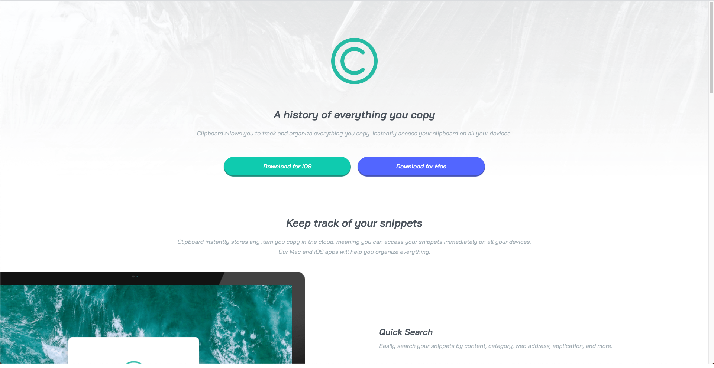

# Frontend Mentor - Clipboard landing page solution

This is a solution to the [Clipboard landing page challenge on Frontend Mentor](https://www.frontendmentor.io/challenges/clipboard-landing-page-5cc9bccd6c4c91111378ecb9). Frontend Mentor challenges help you improve your coding skills by building realistic projects.

## Table of contents

- [Overview](#overview)
  - [The challenge](#the-challenge)
  - [Screenshot](#screenshot)
  - [Links](#links)
- [My process](#my-process)
  - [Built with](#built-with)
  - [What I learned](#what-i-learned)
  - [Continued development](#continued-development)
  - [Useful resources](#useful-resources)
- [Author](#author)
- [Acknowledgments](#acknowledgments)

## Overview

### The challenge

Users should be able to:

- View the optimal layout for the site depending on their device's screen size
- See hover states for all interactive elements on the page

### Screenshot



### Links

- Solution URL: [Solution on Frontendmentor](https://www.frontendmentor.io/solutions/clipboard-landing-page-with-cool-images-64dD-uB6j)
- Live Site URL: [Live Site](https://landon345.github.io/frontendmentor-clipboard-landing-page/)

## My process

### Built with

- Semantic HTML5 markup
- CSS custom properties
- Flexbox
- CSS Grid
- Mobile-first workflow

### What I learned

I learned a little bit about css grid. I mostly learned more about flexbox and positioning images.

```html
<div class="computer-container">
  
  <div class="whole-computer-text">
    <div class="computer-text">
      <h2>Quick Search</h2>
      <p>
        Easily search your snippets by content, category, web address,
        application, and more.
      </p>
    </div>
    <div class="computer-text">
      <h2>iCloud Sync</h2>
      <p>Instantly saves and syncs snippets across all your devices.</p>
    </div>
    <div class="computer-text">
      <h2>Complete History</h2>
      <p>
        Retrieve any snippets from the first moment you started using the app.
      </p>
    </div>
  </div>
</div>
```

```css
.image-computer {
  position: relative;
  left: -200px;
  object-fit: contain;
  height: 55%;
  width: 55%;
}
.image-devices {
  object-fit: contain;
  height: 75%;
  width: 75%;
}
.desktop-container {
  width: 60%;
  margin: auto;
}
.computer-container {
  display: flex;
  align-items: center;
  justify-content: space-around;
}
.whole-computer-text {
  display: flex;
  flex-direction: column;
  width: 50%;
  margin: auto;
  margin-left: -50px;
  text-align: left;
}
.computer-text {
  margin: 20px;
}
h2 {
  margin-left: 30px;
}
.productivity-tools {
  display: flex;
  align-items: center;
  justify-content: space-around;
}
.tools-section {
  display: flex;
  flex-direction: column;
  align-items: center;
  width: 33%;
}
.icon {
  object-fit: contain;
  height: 50px;
}
```

### Continued development

I'll continue to focus on using good spacing and more images in my designs.

### Useful resources

- [CSS Grid](https://www.digitalocean.com/community/tutorials/css-align-justify) - This helped me center items in css grid.

## Author

- Website - [Landon Schlangen](https://www.landonschlangen.com)
- Frontend Mentor - [@Landon345](https://www.frontendmentor.io/profile/Landon345)
- LinkedIn - [Profile](https://www.linkedin.com/in/landon-schlangen-a3989a16b/)

## Acknowledgments

I completed this challenge by doing the mobile design first. It took me about 1.5 hours to do the mobile design and an extra 1.5 hours to put in the desktop design.
